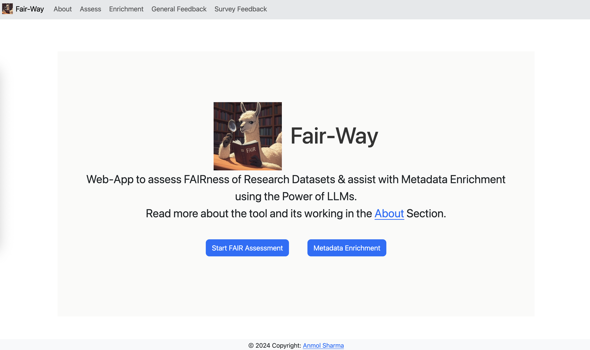
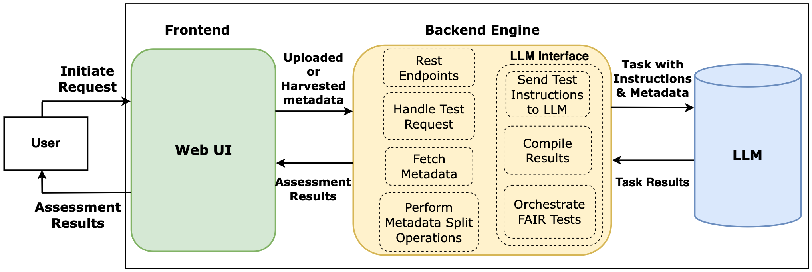
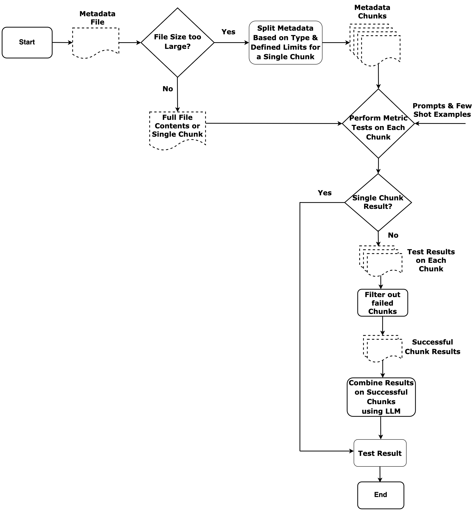

# Fair-Way



A fully automated FAIR assessment system leveraging LLMs, designed for research and academic use. The Fair-Way Tool is a modular system for evaluating the FAIRness (Findable, Accessible, Interoperable, Reusable) of scientific metadata. Core components:

- **Frontend**: Interactive [VueJS](https://vuejs.org/) interface for metadata submission and result visualization
- **Backend**: [Python 3.12](https://www.python.org/) + [FastAPI](https://fastapi.tiangolo.com/) powered engine with Celery task queue and [Redis](https://redis.io/) Message Queue
- **LLM Interface**: Supports [Ollama](https://ollama.ai/) (for local LLMs) and OpenAI API



## 🚀 Features

- Automated FAIR assessment using LLMs based on [FAIRsFAIR Data Object Assessment Metrics (v0.5)](https://www.fairsfair.eu/fairsfair-data-object-assessment-metrics-request-comments)
- Support for assessment of Published datasets (Zenodo, Dryad, HuggingFace Repositories) and uploaded metadata file input
- Custom domain-specific test configuration supported
- Easy deployment with Docker
- Easy to extend for additional FAIR metrics

### How Application Works

The Application uses various techniques to achieve this LLM based evaluation. A demo on the workings of the application can be accessed [here](https://zenodo.org/records/15596063). The figure below describes how a single test execution works.



The pre-defined limits for metadata chunking is defined [here](./configs/global_config.json)

## Getting Started: Deployment and Experimentation

### 📦 Installation & Setup

#### 1. Clone the Repository

```bash
git clone https://github.com/your-username/fairway-tool.git
cd fairway-tool
```

#### 2. Setup (Docker)

Use the provided `docker-compose` files for different environments:

- `docker-compose-dev.yaml`: Development setup (on MacOS)

  - Macos Virtualization doesn't support pass through access to GPU, so this setup enables passing requests to Ollama instance on host machine

- `docker-compose-prod.yaml`: Production deployment
  - Modify as per your needs
  - You can either setup Ollama in docker image or remove this service and point to your own ollama instance using the `.env` file
- `docker-compose-evaluate.yaml`: For evaluation-specific configurations

#### 3. 🧪 Deployment

##### Development (Local on Macos)

```bash
# Build all the services
docker-compose -f docker-compose-dev.yaml build

# Start the whole setup
docker-compose -f docker-compose-dev.yaml up -d
```

If you are on another OS apart from MacOS, please feel free to modify the dev dockerfile and the compose file.

##### Production (Docker)

```bash
# Build all the services
docker-compose -f docker-compose-prod.yaml build

# Start production services
docker-compose -f docker-compose-prod.yaml up -d
```

#### Application Configuration

The main application configuration file is a `.env` file in the backend directory. Use the shared template file as reference. Other configuration files:

- `nginx.conf`: Nginx reverse proxy configuration
  - `default.conf`: server config for nginx for all endpoints
- `redis.conf`: config file for redis
- `wait_for_ollama.sh`: Script to initialize and download LLMs from Ollama Service

### Project Structure

#### 🧱 Key Components: Backend (`backend/`)

- `main.py`: FastAPI entry point
- `config.py`: Application configuration for logging and celery
- `splitter.py`: Text chunking implementation using LangChain

- `routes.py`: Encompassing all backend routes

## Extending/Modifying Metrics

The metrics reside in the directory `backend/fair_analysis/fair_metrics/`. All the metrics follow a similar template inside their directory:

- A file named `metric.py` which extends the base metric class in `backend/fair_analysis/MetricBase.py`
  - You will have to define the abstract methods `execute_tests` and `score_test_results` for each new metric you define
- Set of associated tests for the given metric defined in `fair_tests` directory
- Then to enable the metric, add it to the list of metrics used in `backend/fair_analysis/fair_analyzer.py` file.

The tests with a metric can also be defined by importing `backend/fair_analysis/TestBase.py` and extending based on this base class.

## Citation 

You can find the link to our accepted paper at CIKM'25 [here](https://doi.org/10.1145/3746252.3760811).

Please cite Fair-Way as:

```
@inproceedings{Sharma2025FairWay,
 author    = {Sharma, Anmol and Sowe, Sulayman K. and Kim, Soo-Yon
              and Hoseini, Sayed and Limani, Fidan and Boukhers, Zeyd
              and Lange, Christoph and Decker, Stefan},
 title     = {FAIR Data Assessment Using LLMs: The Fair‑Way},
 booktitle = {Proceedings of the 34th ACM International Conference on Information and Knowledge Management (CIKM '25)},
 year      = {2025},
 doi       = {10.1145/3746252.3760811},
 url       = {https://doi.org/10.1145/3746252.3760811}
}
```
